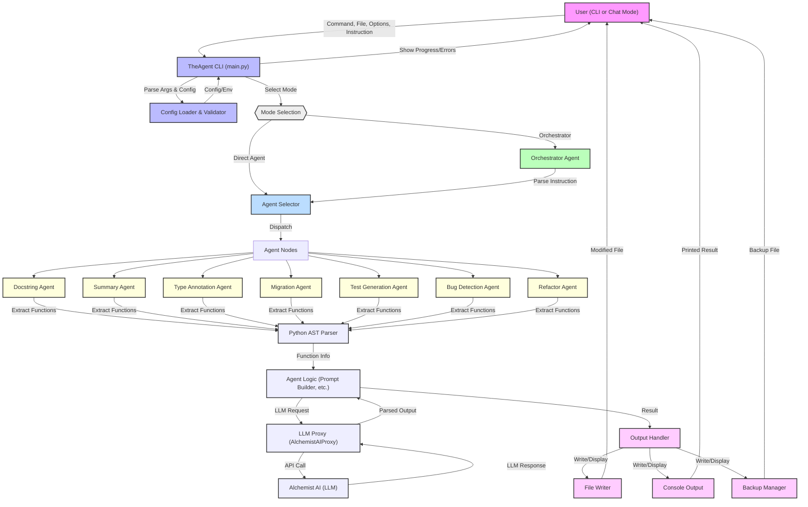

[](https://github.com/haroon0x/TheAgent/actions/workflows/ci.yml)

# TheAgent

> TheAgent: Your all-in-one Python CLI code agent for docstrings, summaries, migration, tests, bug detection, and more—powered by PocketFlow and Alchemist AI.

**TheAgent** is a powerful, extensible command-line tool that automates Python code understanding and transformation tasks. With a single CLI, you can:
- Generate Google-style docstrings, summaries, and type annotations
- Migrate code to new versions or libraries
- Detect bugs, refactor code, and generate tests
- Orchestrate multi-step code workflows using natural language instructions

Built on a modular, agentic architecture, TheAgent leverages PocketFlow for flexible node orchestration and Alchemist AI for LLM-powered code analysis. Its design makes it easy to add new agent types and integrate with any LLM backend.

## Architecture Overview



## Overview
This project provides an intelligent agent called **TheAgent** that automates the creation of high-quality, Google-style docstrings for Python functions and much more. It uses PocketFlow for agent orchestration and Alchemist AI (via a proxy) for LLM-powered code analysis and generation.

**Why TheAgent?**
- Flexible: Supports docstring, summary, type annotation, migration, test generation, bug detection, refactor, and orchestrator agents.
- Brandable: TheAgent is designed to be extended for any code automation or analysis task.
- User-centric: CLI and chat modes for both power users and beginners.

*TheAgent is a strong, brandable name chosen for its flexibility and future-proofing. You can extend it to any code automation or agentic workflow you need.*

## Extensibilty - To add a new agent:
- Add a method to AlchemistAIProxy.
- Add a Node class in nodes.py.
- Add a case in create_doc_agent_nodes and the CLI.

## Features

- Reads Python source files and extracts all function definitions
- Calls an LLM to generate Google-style docstrings for each function
- Supports output to console, in-place file modification (with backup), or writing to a new file
- CLI interface with options for LLM model, confirmation prompts, and verbosity
- **Multiple agent types:** docstring, summary, type annotation, migration, test generation, bug detection, refactor
- **Automated tests and CI integration**

## Installation

1. Install [uv](https://github.com/astral-sh/uv):
   ```sh
   pip install uv
   ```
2. Install dependencies:
   ```sh
   uv pip install -r requirements.txt
   ```
   Or, using pyproject.toml:
   ```sh
   uv pip install -r requirements.txt
   uv pip install -e .
   ```

3. Set your Alchemist AI API key in your environment:
   ```sh
   export ALCHEMYST_API_KEY=your_key_here
   ```
   Or create a `.env` file with:
   ```
   ALCHEMYST_API_KEY=your_key_here
   ```

## Usage

```sh
python main.py --file my_module.py --output in-place --llm alchemyst-ai/alchemyst-c1 --verbose
```

- `--file <filepath>`: Path to the Python file to process (required)
  - Example: `--file my_module.py`
- `--output <mode>`: Output mode: `console` (default), `in-place`, or `new-file`
  - Example: `--output in-place`
- `--llm <model_name>`: LLM model to use (default: `alchemyst-ai/alchemyst-c1`)
  - Example: `--llm alchemyst-ai/alchemyst-c1`
- `--no-confirm`: Skip confirmation prompts for destructive actions
  - Example: `--no-confirm`
- `--verbose`: Print detailed progress
  - Example: `--verbose`
- `--agent <type>`: Agent type: `doc`, `summary`, `type`, `migration`, `test`, `bug`, `refactor`
  - Example: `--agent doc`
- `--migration-target <target>`: Migration target for migration agent (e.g., "Python 3")
  - Example: `--migration-target "Python 3"`

## CLI Arguments

| Argument                        | Description                                                                 | Example Usage                                      |
|---------------------------------|-----------------------------------------------------------------------------|----------------------------------------------------|
| `--file <filepath>`             | Path to the Python file to process (**required**)                            | `--file my_module.py`                              |
| `--output <mode>`               | Output mode: `console` (default), `in-place`, or `new-file`                 | `--output in-place`                                |
| `--llm <model_name>`            | LLM model to use (default: `alchemyst-ai/alchemyst-c1`)                     | `--llm alchemyst-ai/alchemyst-c1`                  |
| `--no-confirm`                  | Skip confirmation prompts for destructive actions (e.g., in-place changes)   | `--no-confirm`                                     |
| `--verbose`                     | Print detailed progress                                                     | `--verbose`                                        |
| `--agent <type>`                | Agent type: `doc`, `summary`, `type`, `migration`, `test`, `bug`, `refactor`